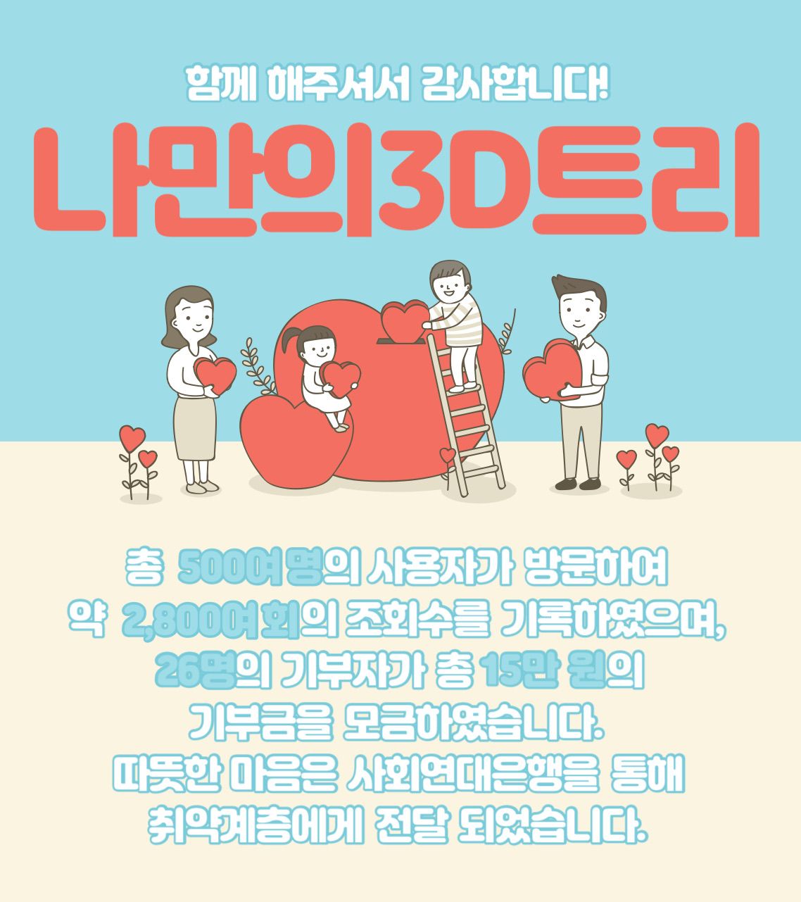
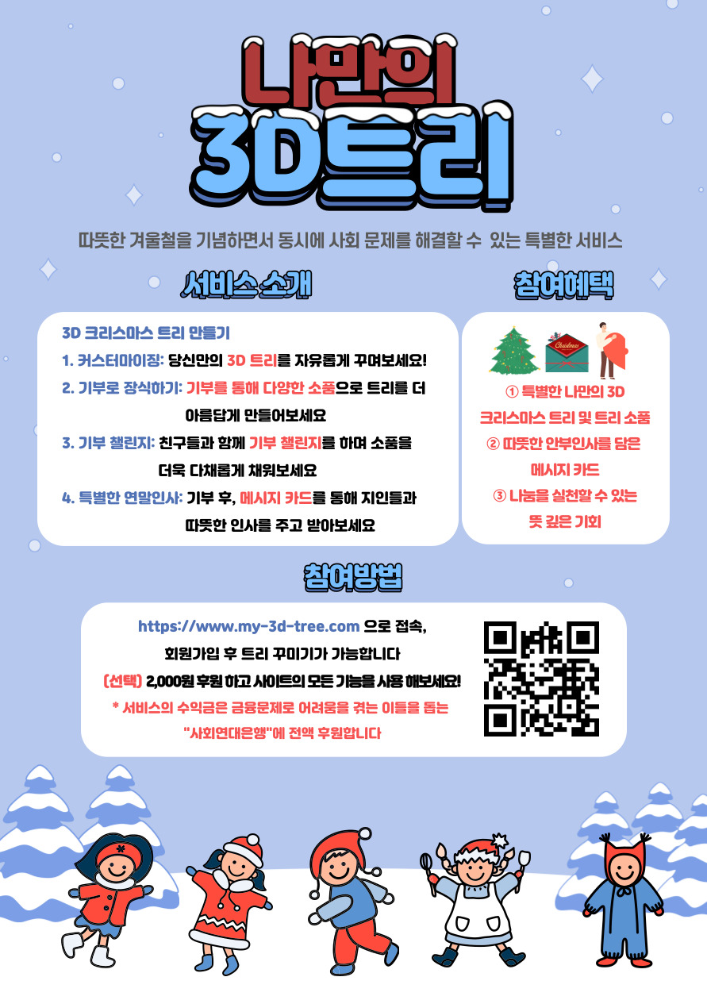
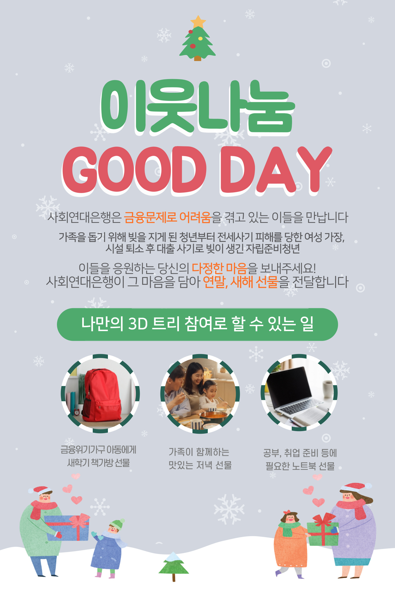
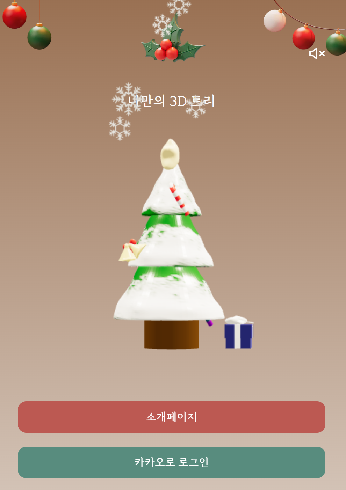
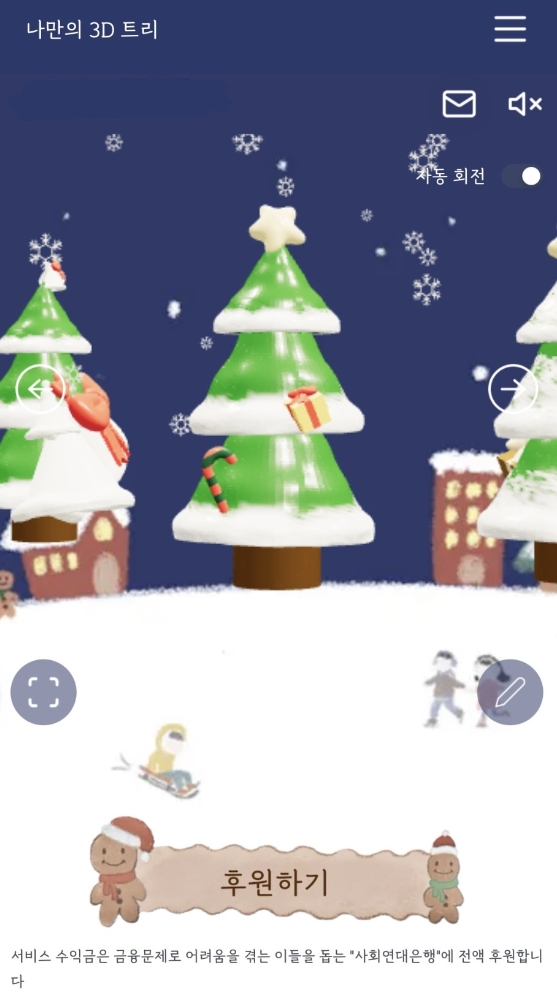
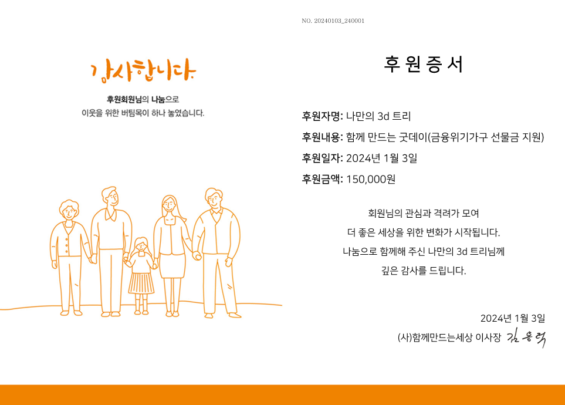

# 🎄 나만의 3D 트리
<div>
<br>
</div>

```
나만의 3D 트리는 감성을 자극하는 겨울철 이벤트 성 서비스입니다. 커스터마이징 할 수 있는 3D 크리스마스 트리를 제공하고, 사회 문제 해결을 위한 기부 참여를 유도합니다.
```

## 🐙 프로젝트 소개
```
2023 1th 동국톤 (동국대학교 주최) / Server Repository
2023.12.18 - 2023.12.20 (3日)
```

## 💁🏻‍♀️ 따숲따숲 팀
| 역할 | 이름 |
|----| ----- |
| 기획 | 이설 |
| 디자인 | 이민지 |
| 프론트 | 황재형 | 
| 프론트 | 김동민 |
| 백엔드 | 유수민 |
| 백엔드 | 홍정표 |


## 1. 개발환경 및 기술스택
<details>
  <summary>Common</summary>

* Code Management</br>


* Document Share</br>


* Api Endpoint Share</br>


</details>

<details>
  <summary>Back-End</summary>
  
* Language</br>


* Database</br>


* Deploy</br>


* IDE</br>


</details>

<details>
  <summary>Front-End</summary>
  
* Language</br>


* State Library</br>


* Design Library</br>


* Ajax Management Library</br>


* Deploy</br>


* IDE</br>


</details>


## 2. 프로젝트 설명

### 서비스 개요
**감성**을 자극하여 지속적인 서비스 방문을 유도합니다. 3D 트리를 **커스터마이징** 할 수 있고 기부를 하면 장식할 수 있는 장식품의 리미트가 풀리는 서비스입니다. 겨울철 이벤트로 출시하여, 최종적으로 사회연대은행에 **기부**가 진행되었습니다.

### 서비스 개발 배경
##### 겨울철 이벤트성 서비스의 필요성
겨울철에는 크리스마스, 연말연시 등 다양한 이벤트가 열리기 때문에 이벤트 성 서비스에 대한 수요가 높습니다.

##### 사회문제 해결을 위한 기부 참여의 필요성
최근 사회문제에 대한 관심이 높아지고 있지만, 기부 참여율은 여전히 낮은편입니다. 이 서비스는 기부에 대한 부담감을 줄이고, 재미와 의미를 더함으로써 기부 참여를 유도할 수 있습니다.

### 대상

<div>

</div>
20 ~ 30대 청년

### 기능 소개
```
- 기부를 하면 3D 트리에 소품을 장식할 수 있는 기회를 제공한다.
- 소품을 클릭하면 메시지가 뜨도록 한다.
- 산타의 메시지에 기부자가 작성한 크리스마스 카드를 게시하여 기부 참여에 대한 자부심 고취시킨다.
- 크리스마스카드는 기부자가 요청한 사람에게 전달되어 연말 안부 인사 전달과 선행챌린지 진행한다.
```

### 홍보자료

<p align="center">


</p>

<p align="center">


</p>

## 💌 후원증서
<div align="center">
<br>
</div>

```
✨ 사회연대은행에 기부
청년, 여성, 자립준비 청년 등 금융 문제를 겪는 이들에게 도움을 제공하는 단체.

✨ 컨택 방법 
1. 펀딩이 아닌 정식 후원을 진행하고 있으면서 문제가 발생하지 않은 기부처 선별
2. 기부처 총 7곳에 프로젝트 기획안 일부를 포함한 컨택 메일 제출
3. 최종적으로, 사회연대은행 기부처 선정
```